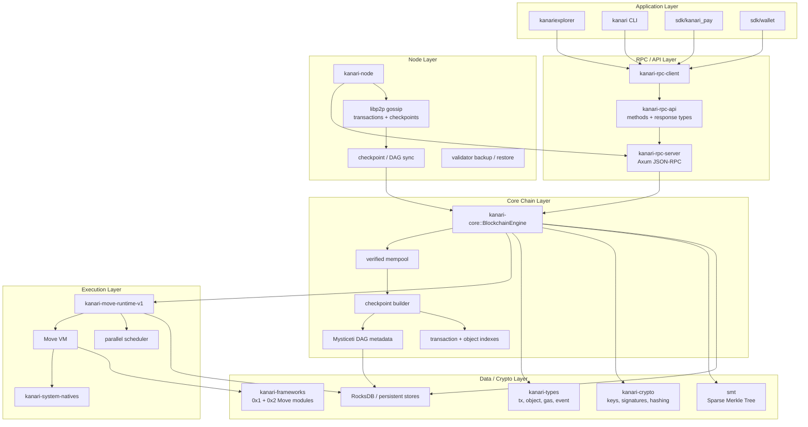
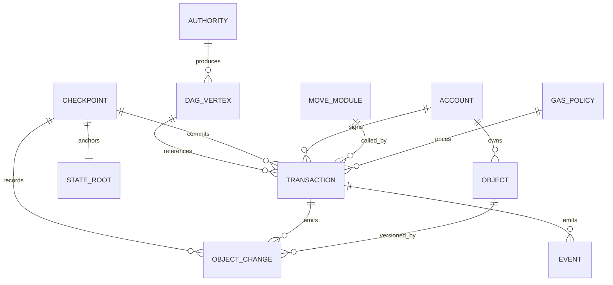

# Protocol Stack

Kanari is organized as a layered Move/object chain. Applications submit signed work through JSON-RPC; nodes gossip transactions and checkpoints; the core engine builds deterministic checkpoint work; the Move runtime executes state transitions; RocksDB and SMT roots persist the canonical state.

## Layer responsibilities

| Layer | Responsibility |
| --- | --- |
| Application | Explorer, CLI, wallets, and payment SDKs create and inspect user activity. |
| RPC / API | Axum JSON-RPC validates request shape, applies concurrency limits, and returns typed responses. |
| Node | Runs RPC, libp2p gossip, checkpoint sync, identity, consensus keys, and backup tooling. |
| Core chain | Owns mempool, checkpoint production, state roots, transaction/object indexes, and DAG metadata. |
| Execution | Runs Move VM calls, native functions, scheduler logic, and state changes. |
| Data / crypto | Stores canonical state, object records, SMT roots, framework modules, signatures, and hashes. |

## Entity relationship overview

This diagram is a documentation view of the runtime flow, not a database schema. The authoritative data lives in the Rust types, RocksDB stores, checkpoints, and SMT state root.
